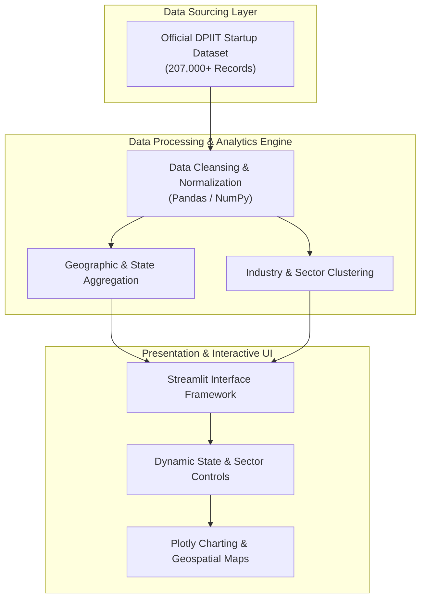

# Startup Pulse India: National DPIIT Analytics Playbook

An interactive data analytics playbook built to track, visualize, and analyze over 207,000+ officially recognized DPIIT startups across Indian states, sectors, and growth stages.

* **Live Application:** [india-startup-playbook.streamlit.app](https://india-startup-playbook.streamlit.app/)
* **Repository:** [github.com/sajesh-nair/india-startup-playbook](https://github.com/sajesh-nair/india-startup-playbook)
* **Developer:** Sajesh Nair

---

## Executive Summary

Navigating India's rapidly expanding entrepreneurial ecosystem requires granular visibility into state-level density, sectoral concentration, and emerging hub growth. **Startup Pulse India** aggregates official DPIIT (Department for Promotion of Industry and Internal Trade) records to provide an interactive intelligence playbook for investors, policy analysts, and founders.

The platform processes large-scale government datasets to help users uncover geographic clusters, industry-wise distribution, and long-term growth trajectories across the nation's innovation landscape.

---

## System Architecture & Data Flow

Key Features
Geographic Cluster Mapping: Track state and city-level startup density to identify established metropolitan hubs and tier-2/3 emerging startup corridors.

Sectoral Distribution Analytics: Analyze industrial concentration across FinTech, DeepTech, EdTech, Healthcare, Agritech, and manufacturing sectors.

Dynamic Filtering: Filter dataset views by registration year, state, district, and specific sector classifications.

Interactive Plotly Visualizations: High-resolution charts, choropleth maps, and trend breakdowns designed for clear scannability.

Technical Stack
Data Processing: Python, Pandas, NumPy

Interactive Analytics Framework: Streamlit

Data Visualization: Plotly Express / Graph Objects

Deployment Platform: Streamlit Community Cloud

Local Development Setup
1. Clone the repository
Bash
git clone [https://github.com/sajesh-nair/india-startup-playbook.git](https://github.com/sajesh-nair/india-startup-playbook.git)
cd india-startup-playbook
2. Set up virtual environment
Bash
# Windows
python -m venv env
env\Scripts\activate

# macOS / Linux
python3 -m venv env
source env/bin/activate
3. Install dependencies
Bash
pip install -r requirements.txt
4. Launch the application
Bash
streamlit run app.py
